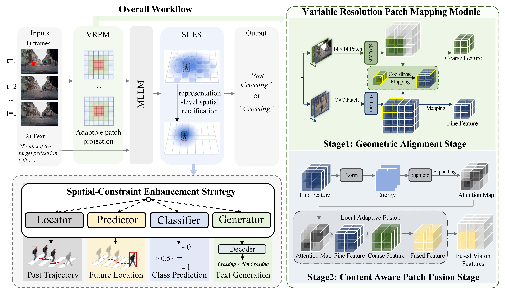
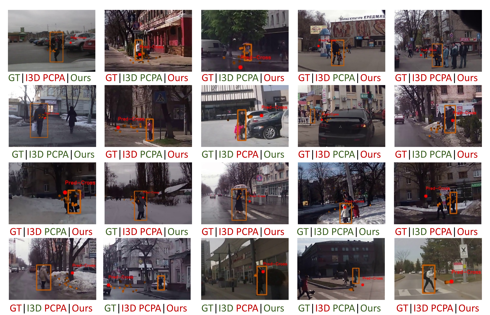

# Unified Vision-Centric Pedestrian Crossing Action Prediction via Adaptive Patch Projection and Proactive Spatial Rectification

This repository is the official implementation of ViCross. We propose a unified vision-centric framework for pedestrian crossing action prediction based on Multimodal Large Language Models (MLLMs). With only first-frame target initialization, ViCross performs target-centric reasoning directly from video frames. The proposed Variable Resolution Patch Mapping and Spatial Constraint Enhancement Strategy improve visual token efficiency and spatial grounding, leading to strong performance on benchmark datasets.


<div style="text-align:center">

</div>

## Environmental setup
* Conda environment settings:
```bash
conda env create -f environment.yml
conda activate vicross
pip install -r requirements.txt
```

## Data 
* Please download and preprocess the datasets following the instructions of [PIE](https://github.com/aras62/PIE.git) and [JAAD](https://github.com/ykotseruba/JAAD.git).
* Download the checkpoint of the MLLM using the following commands:
> ```bash
>pip install modelscope
>modelscope download --model 'Qwen/Qwen2-VL-7B-Instruct'
>```


## Training
* Please modify the address information in the .sh file and action_dataset.py file according to your file location.
> ### 1. JAAD_beh
> ```bash
>./scripts/train_jaad_beh.sh   
>```

> ### 2. JAAD_all
> ```bash
>./scripts/train_jaad_all.sh  
>```

> ### 3. PIE
> ```bash
>./scripts/train_pie.sh  
>```

## Testing
* Download the checkpoint from https://pan.baidu.com/s/1_X6vo0KSg5oz0yd-duM4ow?pwd=p9ma

> ### 1. JAAD_beh
> ```bash
>./scripts/infer_jaad_beh.sh   
>```

> ### 2. JAAD_all
> ```bash
>./scripts/infer_jaad_all.sh  
>```

> ### 3. PIE
> ```bash
>./scripts/infer_pie.sh  
>```


## Examples
<div style="text-align:center">

</div>


<!-- ## Citation
If you find our code or paper useful, please consider citing our paper:
```BibTeX
@article{wang2025actionllm,
  title={Multimodal Large Models Are Effective Action Anticipators},
  author={Wang, Binglu and Tian, Yao and Wang, Shunzhou and Yang, Le}
  journal={IEEE Transactions on Multimedia},
  year={2025},
  publisher={IEEE}
}
``` -->

## Acknowledgement
This repo borrows some data and codes from [swift](https://github.com/modelscope/ms-swift.git), [PCPA](https://github.com/ykotseruba/PedestrianActionBenchmark.git) and [PIE](https://github.com/aras62/PIE.git). Thanks for their great works.

